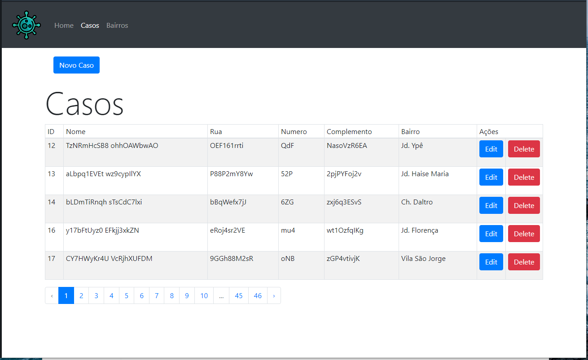
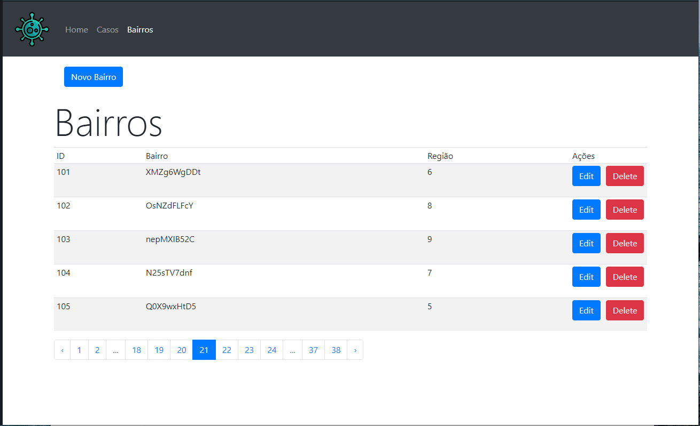
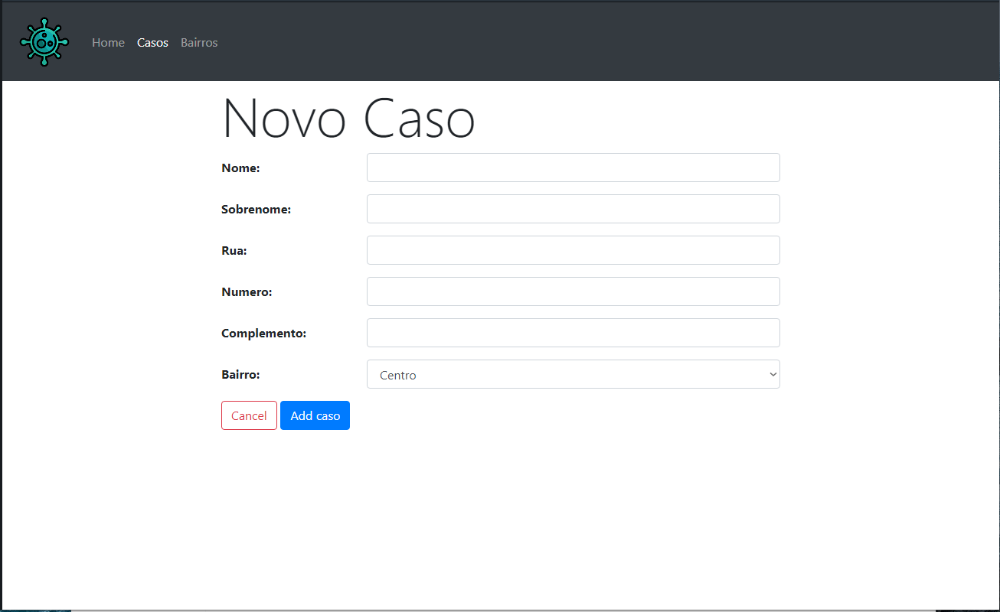
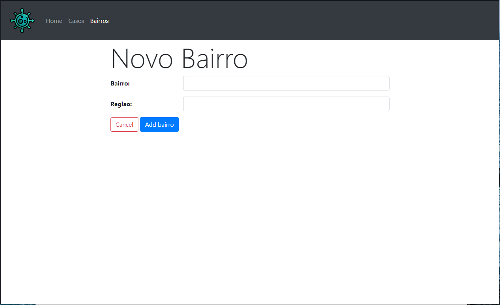

# Projeto-Combate-COVID19
Cadastro de casos positivos do COVID-19 no município de Araras:
CRUD dos casos positivos, separando-os por bairros.

## Framework PHP
<p><a href="https://laravel.com" target="_blank" rel="noopener"></a></p>

Open source PHP image handling and manipulation library
<p><a href="http://image.intervention.io">http://image.intervention.io</a></p>

## Comandos> 
``` bash
composer update
php artisan key:generate
php artisan db:seed --class=casosTableSeeder
```

## Screenshot>





